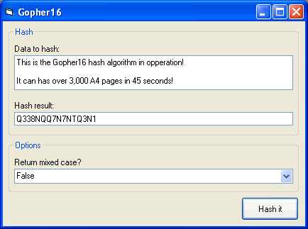



## Gopher16 \- Hashing algorithm \[update\]

### Description

Gopher16 has been designed to create a 128-bit hash of any data that is input into it. The main purpose of Gopher16 is to create hashes for passwords so that if your password store were to be compramised then the hacker wouldn't be able to see the actual password. They would just see the hash, which can't be turned back into the original password.
 
### More Info
 
The data to be hashed and a boolean value of if the hash is to return as mixed case or non-mixed case.

Returns a 128-bit hash of the data input.

             |
---                |---
**Submitted On**   |2005-05-08 14:20:42
**By**             |[Ashley Bissell](https://github.com/Planet-Source-Code/PSCIndex/blob/master/ByAuthor/ashley-bissell.md)
**Level**          |Intermediate
**User Rating**    |3.8 (15 globes from 4 users)
**Compatibility**  |VB 5\.0, VB 6\.0
**Category**       |[Encryption](https://github.com/Planet-Source-Code/PSCIndex/blob/master/ByCategory/encryption__1-48.md)
**World**          |[Visual Basic](https://github.com/Planet-Source-Code/PSCIndex/blob/master/ByWorld/visual-basic.md)
**Archive File**   |[Gopher16\_\-188603592005\.zip](https://github.com/Planet-Source-Code/ashley-bissell-gopher16-hashing-algorithm-update__1-60415/archive/master.zip)

